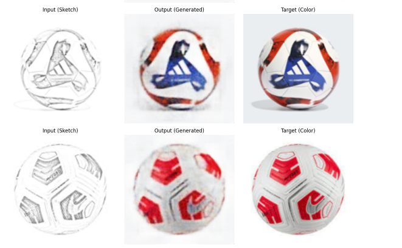

# 🎨 Autoencoder untuk Pewarnaan Gambar Bola

Proyek ini merupakan implementasi autoencoder sederhana menggunakan PyTorch untuk melakukan pewarnaan (colorization) gambar grayscale dari bola sepak. Model dilatih untuk mempelajari representasi dari gambar berwarna dan merekonstruksi warna berdasarkan input gambar grayscale/sketsa.

---

## 🗂️ Dataset

Dataset yang digunakan terdiri dari dua folder:

- `bola/` - berisi gambar grayscale (input).
- `ball/` - berisi gambar berwarna asli (target).

Kedua folder memiliki gambar yang saling berkorespondensi satu sama lain (nama file sama), dengan ukuran yang telah di-resize menjadi `128x128`.

Lokasi dataset:  
`D:/auto_encoder/bola`  
`D:/aut_oencoder/ball`

---

## 🧠 Arsitektur Autoencoder

Model autoencoder terdiri dari dua bagian:

### Encoder
- `Conv2d(3, 64, kernel_size=4, stride=2, padding=1)`
- `ReLU`
- `Conv2d(64, 128, kernel_size=4, stride=2, padding=1)`
- `ReLU`

### Decoder
- `ConvTranspose2d(128, 64, kernel_size=4, stride=2, padding=1)`
- `ReLU`
- `ConvTranspose2d(64, 3, kernel_size=4, stride=2, padding=1)`
- `Tanh`

Model menerima input 3-channel (sketsa yang diulang ke RGB), dan menghasilkan prediksi 3-channel (warna RGB). Output dinormalisasi ke rentang `[-1, 1]` menggunakan fungsi aktivasi `Tanh`.

---

## 📈 Performa Model

Model dilatih menggunakan fungsi loss **Mean Squared Error (MSE)** antara gambar prediksi dan gambar target.

- Optimizer: Adam (`lr=0.001`)
- Epochs: 640
- Batch size: full dataset (karena dataset kecil)
- Loss berkurang secara konsisten hingga konvergen.

Contoh hasil training:
```
Epoch 20/640, Loss: 0.1566
Epoch 640/640, Loss: 0.0086
```

---

## 📊 Contoh Input dan Output

Berikut adalah contoh hasil prediksi dari model:



> Model berhasil menghasilkan warna yang cukup realistis dan mendekati target, meskipun dataset kecil dan arsitektur masih sederhana.

---


